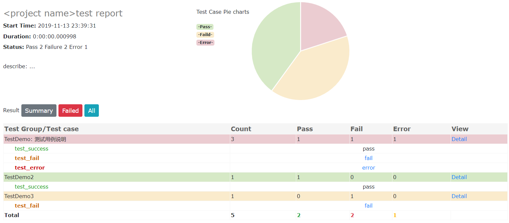

# HTMLTestRunner

HTMLTestRunner for Python3

HTMLTestRunner:http://tungwaiyip.info/software/HTMLTestRunner.html

介绍：
  HTMLTestRunner是针对Python2.x的unittest单元测试框架用于生成HTML测试报告的扩展。但是，它并不支持Python3.x,所以，我做了一点小小的修改，使其可以在Python3下使用。


使用方法：
  克隆HTMLTestRunner.py文件，将其复制到../Python36/Lib/目录下即可。

demo:
```python
import HTMLTestRunner
import unittest

class TestDemo(unittest.TestCase):

    def test_success(self):
        self.assertEqual(5, 5)

    @unittest.skip("skip case")
    def test_skip(self):
        pass

    def test_fail(self):
        self.assertEqual(5, 6)

    def test_error(self):
        self.assertEqual(a, 6)


class TestDemo2(unittest.TestCase):

    def test_success(self):
        self.assertEqual(2+2, 4)

class TestDemo3(unittest.TestCase):

    def test_fail(self):
        self.assertEqual(3, 4)


if __name__ == '__main__':
    suit=unittest.TestSuite()
    suit.addTest(TestDemo("test_success"))
    suit.addTest(TestDemo("test_skip"))
    suit.addTest(TestDemo("test_fail"))
    suit.addTest(TestDemo("test_error"))
    suit.addTest(TestDemo2("test_success"))
    suit.addTest(TestDemo3("test_fail"))

    fp = open('./result.html', 'wb')
    runner =HTMLTestRunner.HTMLTestRunner(stream=fp,
                                          title=u'<project name>test report',
                                          description=u'describe: ... ')

    runner.run(suit)
    fp.close()
```

测试报告：

