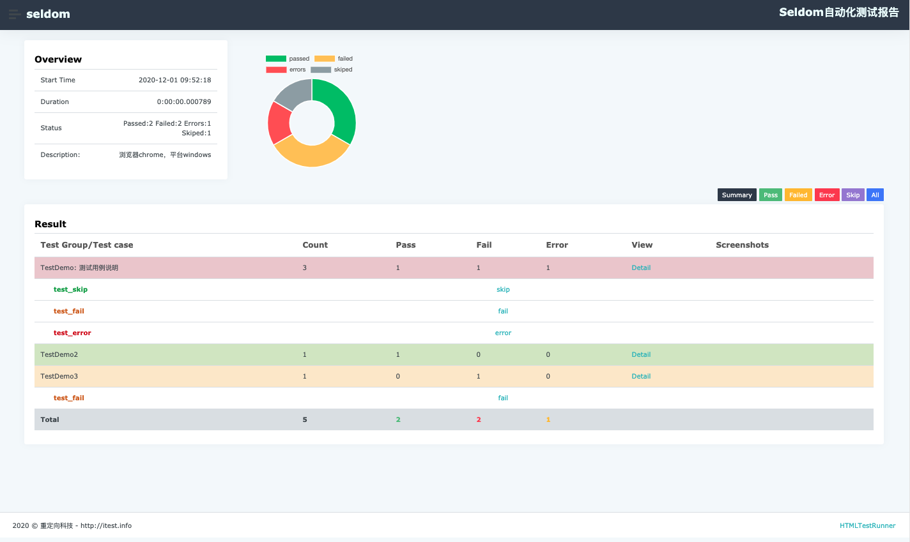

# HTMLTestRunner

HTMLTestRunner for Python3

HTMLTestRunner:http://tungwaiyip.info/software/HTMLTestRunner.html

介绍：
  HTMLTestRunner是针对Python2.x的unittest单元测试框架用于生成HTML测试报告的扩展。但是，它并不支持Python3.x,所以，我做了一点小小的修改，使其可以在Python3下使用。


## install

```shell
git clone https://github.com/SeldomQA/HTMLTestRunner
cd HTMLTestRunner/
python setup.py install
```

## demo

```python
import unittest
from TestRunner import HTMLTestRunner


class TestDemo(unittest.TestCase):
    """测试用例说明"""

    def test_success(self):
        """执行成功"""
        self.assertEqual(2 + 3, 5)

    @unittest.skip("skip case")
    def test_skip(self):
        pass

    def test_fail(self):
        self.assertEqual(5, 6)

    def test_error(self):
        self.assertEqual(a, 6)


class TestDemo2(unittest.TestCase):

    def test_success(self):
        self.assertEqual(2 + 2, 4)


class TestDemo3(unittest.TestCase):

    def test_fail(self):
        self.assertEqual(3, 4)


if __name__ == '__main__':
    suit = unittest.TestSuite()
    suit.addTest(TestDemo("test_success"))
    suit.addTest(TestDemo("test_skip"))
    suit.addTest(TestDemo("test_fail"))
    suit.addTest(TestDemo("test_error"))
    suit.addTest(TestDemo2("test_success"))
    suit.addTest(TestDemo3("test_fail"))

    with(open('test/result.html', 'wb')) as fp:
        runner = HTMLTestRunner(
            stream=fp,
            title='<project name>test report',
            description='describe: ... '
        )
        runner.run(suit)
```
**HTMLTestRunner类说明：**

* stream ： 指定报告的路径
* title ： 报告的标题
* description ： 报告的描述

**run()方法说明:**
* suit ： 运行的测试套件
* rerun ：重跑次数
* save_last_run ：是否保存最后一个结果

## send mail

HTMLTestRunner 集成了发邮件功能。

```python
import unittest
from TestRunner import HTMLTestRunner
from TestRunner import SMTP

# ...

if __name__ == '__main__':
    suit = unittest.TestSuite()
    # ...

    report = "./result.html"
    with(open(report, 'wb')) as fp:
        runner = HTMLTestRunner(
            stream=fp,
            title='Seldom自动化测试报告',
            description='浏览器chrome，平台windows'
        )
        runner.run(suit)
    # 发邮件功能
    smtp = SMTP(user="user@126.com", password="123", host="smtp.126.com")
    smtp.sender(to="user@126.com", attachments=report)
```

**SMTP类说明：**
* user 发送者邮箱帐号
* password 发送者邮箱密码
* host 邮箱服务器地址

**sender()方法说明：**

* to 接收者邮箱
* attachments 附件

## show
* test report


* mail

