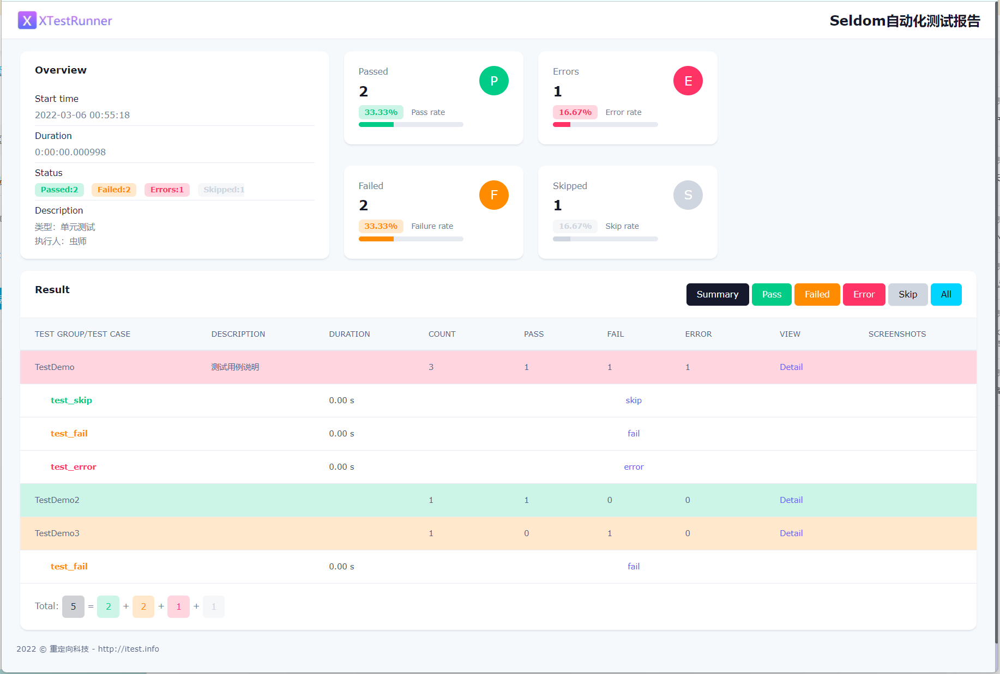

> Modern style test report based on unittest framework.

基于unittest框架现代风格测试报告。

### 特点

* 漂亮测试报告让你更愿意编写测试。
* 支持`单元`、`Web UI`、`API` 各种类型的测试。
* 支持`Selenium`运行失败/错误自动截图。
* 支持失败重跑。
* 支持标签黑、白名单。
* 支持发邮件功能。
* 支持多语言`en`、`zh-CN` 等。
* 支持`HTML/XML`不同格式的报告。

## Report




## Install

```shell
> pip install XTestRunner
```

If you want to keep up with the latest version, you can install with github repository url:

```shell
> pip install -U git+https://github.com/SeldomQA/XTestRunner.git@master
```

## demo

查看更多使用 [例子](./test)。

* unittest测试

```python
import unittest
from XTestRunner import HTMLTestRunner


class TestDemo(unittest.TestCase):
    """测试用例说明"""
    
    def test_success(self):
        """执行成功"""
        self.assertEqual(2 + 3, 5)
    
    @unittest.skip("skip case")
    def test_skip(self):
        """跳过用例"""
        pass
    
    def test_fail(self):
        """失败用例"""
        self.assertEqual(5, 6)
    
    def test_error(self):
        """错误用例"""
        self.assertEqual(a, 6)

if __name__ == '__main__':
    suit = unittest.TestSuite()
    suit.addTests([
        TestDemo("test_success"),
        TestDemo("test_skip"),
        TestDemo("test_fail"),
        TestDemo("test_error")
    ])
    
    with(open('./result.html', 'wb')) as fp:
        runner = HTMLTestRunner(
            stream=fp,
            title='<project name>test report',
            description='describe: ... ',
            language='en',
        )
        runner.run(
            testlist=suit,
            rerun=2,
            save_last_run=False
        )
```

## Document

[中文文档](./docs/README.md)

## 感谢

感谢从以下项目中得到思路和帮助。

* [HTMLTestRunner](http://tungwaiyip.info/software/HTMLTestRunner.html)

* [HTMLTestRunner_cn](https://github.com/GoverSky/HTMLTestRunner_cn)

* [Theme style](https://clever-dashboard.webpixels.work/pages/tasks/list-view.html)
