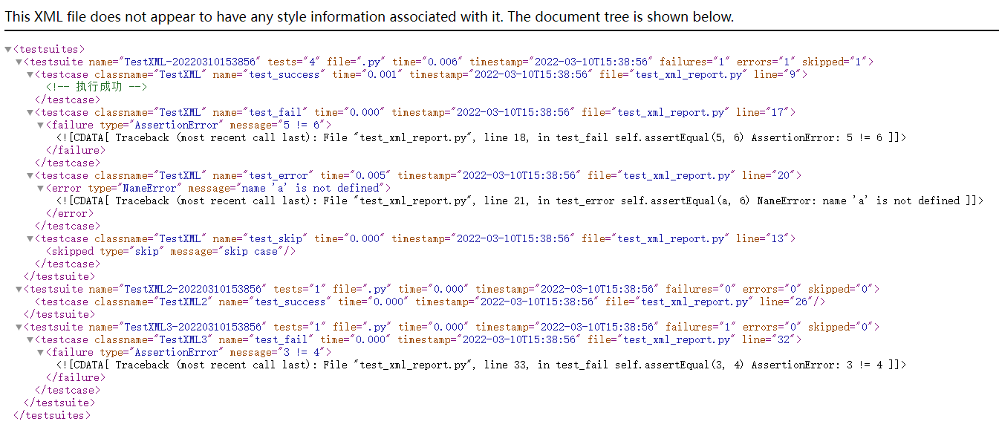

## 其他

XTestRunner还支持一些其他功能。

### 黑白名单

可以通过黑白名单选择要执行（或跳过）的用例。

* 支持白黑名单
  * 白名单：whitelist=["base"]  只有使用@label("base")装饰的用例执行
  * 黑名单：blacklist=["slow"]  只有使用@label("slow")装饰的用例不被执行

__测试用例__

```python
import unittest
from XTestRunner import label
from XTestRunner import HTMLTestRunner


class LabelTest(unittest.TestCase):

    @label("base")
    def test_label_base(self):
        self.assertEqual(1+1, 2)

    @label("slow")
    def test_label_slow(self):
        self.assertEqual(1, 2)

    def test_no_label(self):
        self.assertEqual(2+3, 5)


if __name__ == '__main__':
    report = './reports/label_result.html'
    with(open(report, 'wb')) as fp:
        unittest.main(testRunner=HTMLTestRunner(
            stream=fp,
            title='<project name>test report',
            description='describe: ... ',
            whitelist=["base"],  # 设置白名单
            # blacklist=["slow"],  # 设置黑名单
        ))
```

__注意：__

白名单和黑名单不要同时用，以免产生冲突。


### XML格式报告

虽然，HTML报告的颜值很高，但有时需要提取测试数据，比如保存到数据库，这个时候从HTML报告中提取数据是非常麻烦的，所以，XTestRunner 支持XML格式的报告。

```python
import unittest
from XTestRunner import XMLTestRunner


class TestXML(unittest.TestCase):
    """测试用例说明"""

    def test_success(self):
        """执行成功"""
        self.assertEqual(2 + 3, 5)

    @unittest.skip("skip case")
    def test_skip(self):
        pass

    def test_fail(self):
        self.assertEqual(5, 6)

    def test_error(self):
        self.assertEqual(a, 6)


class TestXML2(unittest.TestCase):

    def test_success(self):
        self.assertEqual(2 + 2, 4)


class TestXML3(unittest.TestCase):

    def test_fail(self):
        self.assertEqual(3, 4)


if __name__ == '__main__':
    # 定义报告
    report = "./reports/xml_result.xml"
    # 运行方式1
    with(open(report, 'wb')) as fp:
        unittest.main(testRunner=XMLTestRunner(output=fp))

    # 运行方式2
    suit = unittest.TestSuite()
    suit.addTests([
        TestXML("test_success"),
        TestXML("test_success"),
        TestXML("test_skip"),
        TestXML("test_fail"),
        TestXML("test_error"),
        TestXML2("test_success"),
        TestXML3("test_fail")
    ])

    with(open(report, 'wb')) as fp:
        runner = XMLTestRunner(output=fp)
        runner.run(suit)

```

__参数说明__

* output: 指定测试报告文件。

__报告展示__



