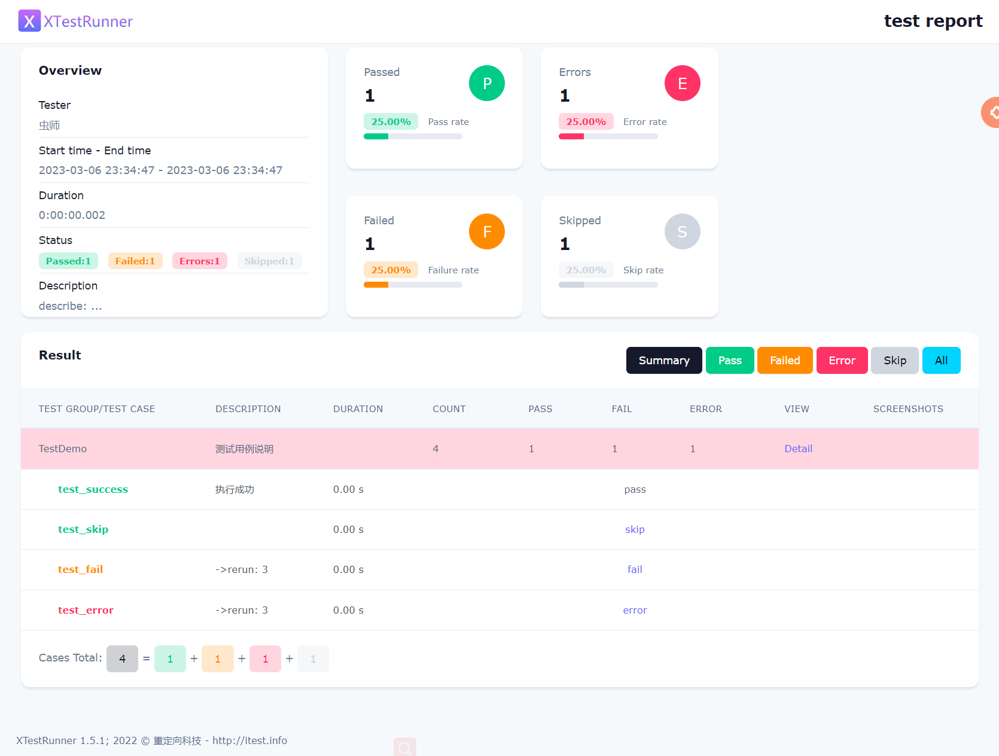

## HTML/XML测试报告

XTestRunner 支持HTML 和 XML 两种格式的测试报告。

* HTML 主要用于运行测试用例，直观查看测试结果。
* XML 主要用户运行收集测试结果，提供平台支持。

> 注： 两种格式采用不同的运行个器，部分参数和功能会有差异。

### HTML测试报告 

XTestRunner基本用法，用于生成 HTML测试报告。

__测试用例__

```python
import unittest
from XTestRunner import HTMLTestRunner


class TestDemo(unittest.TestCase):
    """测试用例说明"""
    
    def test_success(self):
        """执行成功"""
        self.assertEqual(2 + 3, 5)
    
    @unittest.skip("skip case")
    def test_skip(self):
        """跳过用例"""
        pass
    
    def test_fail(self):
        """失败用例"""
        self.assertEqual(5, 6)
    
    def test_error(self):
        """错误用例"""
        self.assertEqual(a, 6)

if __name__ == '__main__':
    suit = unittest.TestSuite()
    suit.addTests([
        TestDemo("test_success"),
        TestDemo("test_skip"),
        TestDemo("test_fail"),
        TestDemo("test_error")
    ])

    html_report = './reports/test_unit_html.html'
    with open(html_report, 'wb') as fp:
        runner = HTMLTestRunner(
            stream=fp,
            tester="虫师",
            title='<project name>test report',
            description='describe: ... ',
            language='en',
            rerun=3
        )
        runner.run(suit)

```

__`HTMLTestRunner`类说明__

* `stream`: 指定报告的路径。
* `title`: 报告的标题。
* `tester`: 指定测试人员。
* `description`: 报告的描述, 支持`str`、`list`两种类型。
* `language`: 支持中文`zh-CN`, 默认`en`。
* `rerun`: 重跑次数。

__`run()`方法说明__

* `testlist`: 运行的测试套件。

__运行测试__

```shell
> python test_unit_html.py
```

__测试报告__




### XML测试报告 

XTestRunner基本用法，用于生成 XML测试报告。

__测试用例__

```python
import unittest
from XTestRunner import XMLTestRunner


class TestDemo(unittest.TestCase):
    """测试用例说明"""

    def test_success(self):
        """执行成功"""
        self.assertEqual(2 + 3, 5)

    @unittest.skip("skip case")
    def test_skip(self):
        pass

    def test_fail(self):
        self.assertEqual(5, 6)

    def test_error(self):
        self.assertEqual(a, 6)


if __name__ == '__main__':
    suit = unittest.TestSuite()
    suit.addTests([
        TestDemo("test_success"),
        TestDemo("test_skip"),
        TestDemo("test_fail"),
        TestDemo("test_error")
    ])

    xml_report = "./reports/test_unit_xml.xml"
    with(open(xml_report, 'wb')) as fp:
        runner = XMLTestRunner(
            output=fp,
            rerun=3
        )
        runner.run(suit)
```

__`XMLTestRunner`类说明__

* `output`: 指定报告的路径。
* `rerun`: 重跑次数。

__`run()`方法说明__

* `testlist`: 运行的测试套件。


