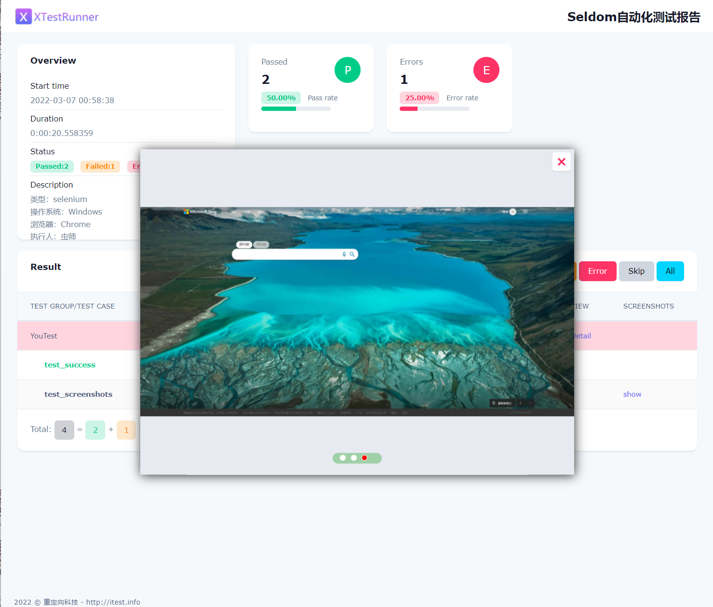
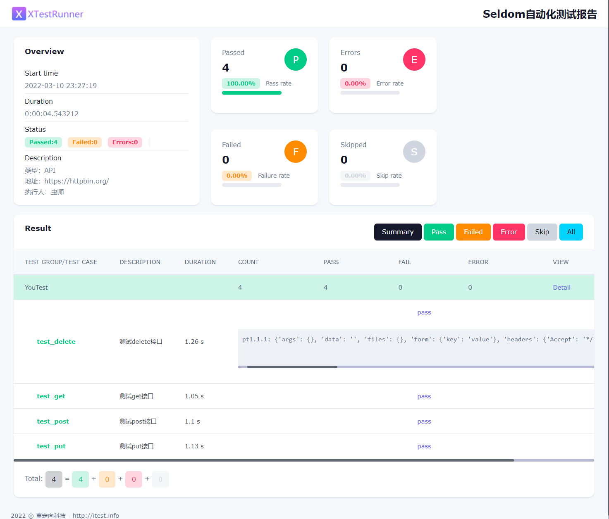

## 不同类型的测试

XTestRunner 支持各种类型的测试。

### 单元测试 

XTestRunner基本用法，用于生成 HTML测试报告。

__测试用例__

```python
# test_unit.py
import unittest
from XTestRunner import HTMLTestRunner
from random import randint


class TestDemo(unittest.TestCase):
    """测试用例说明"""

    def test_success(self):
        """执行成功"""
        self.assertEqual(2 + 3, 5)

    @unittest.skip("skip case")
    def test_skip(self):
        pass

    def test_fail(self):
        """ 失败用例 """
        num = randint(1, 5)
        self.assertEqual(num, 3)

    def test_error(self):
        """ 错误用例 """
        num = randint(1, 1)
        if num == 1:
            self.assertEqual(a, 2)


class TestDemo2(unittest.TestCase):

    def test_success(self):
        """成功用例2"""
        self.assertEqual(2 + 2, 4)


class TestDemo3(unittest.TestCase):

    def test_fail(self):
        """ 失败用例2 """
        num = randint(1, 5)
        self.assertEqual(num, 2)


if __name__ == '__main__':
    report = "./reports/test_unit.html"
    with(open(report, 'wb')) as fp:
        unittest.main(testRunner=HTMLTestRunner(fp, rerun=2))
```

### SeleniumWeb测试

针对Selenium Web自动化测试提供了`失败/错误` 自动截图功能。

__注意__

1.安装selenium
```shell
> pip install selenium
```

2.注意：驱动必须定义为 `driver`， 否则无法生成截图。

__测试用例__

```python
import unittest
from XTestRunner import HTMLTestRunner
from selenium import webdriver
from selenium.webdriver.common.by import By


class SeTest(unittest.TestCase):

    @classmethod
    def setUpClass(cls) -> None:
        cls.driver = webdriver.Chrome()
        cls.base_url = "https://cn.bing.com/"

    @classmethod
    def tearDownClass(cls) -> None:
        cls.driver.quit()

    def test_success(self):
        """测试bing搜索：XTestRunner """
        self.driver.get(self.base_url)
        search = self.driver.find_element(By.ID, "sb_form_q")
        search.send_keys("XTestRunner")
        search.submit()

    def test_error(self):
        """测试bing搜索，定位失败 """
        self.driver.get(self.base_url)
        self.driver.find_element(By.ID, "sb_form_qxxx").send_keys("python")

    def test_fail(self):
        """测试bing搜索，断言失败 """
        self.driver.get(self.base_url)
        self.driver.find_element(By.ID, "sb_form_q").send_keys("unittest")
        self.assertEqual(self.driver.title, "unittest")

    def test_screenshots(self):
        """测试截图"""
        self.driver.get(self.base_url)
        # 元素截图
        elem = self.driver.find_element(By.ID, "sb_form_q")
        self.images.append(elem.screenshot_as_base64)
        # 竖屏截图
        self.images.append(self.driver.get_screenshot_as_base64())
        # 最大化截图
        self.driver.maximize_window()
        self.images.append(self.driver.get_screenshot_as_base64())


if __name__ == '__main__':
    report = "./selenium_result.html"
    with(open(report, 'wb')) as fp:
         unittest.main(testRunner=HTMLTestRunner(
            stream=fp,
            tester="虫师",
            title='Selenium自动化测试报告',
            description=['类型：selenium', '操作系统：Windows', '浏览器：Chrome']
        ))
```

__测试报告__

一个用例支持多张截图，不同的截图自动轮播，而且优化之后，不管是页面元素截图，横向、纵向图片都可以很好的展示。




## API接口测试

XTestRunner 当然也支持HTTP接口测试了。

* 安装requests

```shell
> pip install requests
```

__测试用例__

```python
import json
import requests
import unittest
from XTestRunner import HTMLTestRunner


def formatting(msg):
    """formatted message"""
    if isinstance(msg, dict):
        return json.dumps(msg, indent=2, ensure_ascii=False)
    return msg


class ApiTest(unittest.TestCase):

    def test_get(self):
        """测试get接口 """
        r = requests.get("https://httpbin.org/get", params={"key": "value"})
        print(formatting(r.json()))

    def test_post(self):
        """测试post接口 """
        r = requests.post("https://httpbin.org/post", data={"key": "value"})
        print(formatting(r.json()))

    def test_put(self):
        """测试put接口 """
        r = requests.put("https://httpbin.org/put", data={"key": "value"})
        print(formatting(r.json()))

    def test_delete(self):
        """测试delete接口 """
        r = requests.delete("https://httpbin.org/delete", data={"key": "value"})
        print(formatting(r.json()))


if __name__ == '__main__':
    report = "./reports/test_api.html"
    with(open(report, 'wb')) as fp:
        unittest.main(testRunner=HTMLTestRunner(
            stream=fp,
            tester="虫师",
            title='api自动化测试报告',
            description=['类型：API', '地址：https://httpbin.org/']
        ))
```

__测试报告__

通过`print()` 可以讲接口信息打印到报告中展示。



